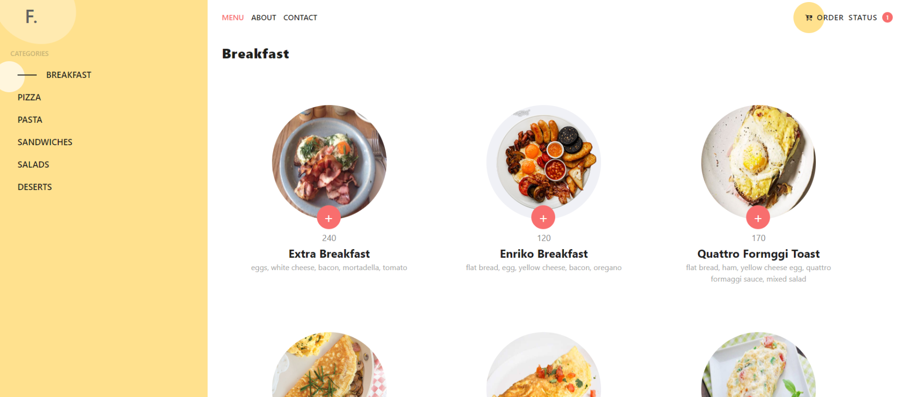
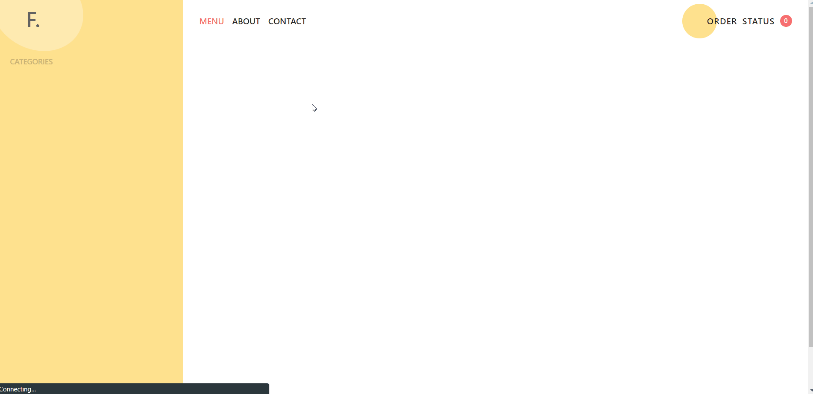

## About the Food order app

I created this application in 2020 (February) in order to practice react.
It is an application in which users can place online orders for different types of dishes.

---

## Backend tech stack
- .NetCore 2.1
- Entity Framework Core
- MS SQL Server

[The core business logic implementation](/FoodOrderApp.Service) 🚀

## Frontend tech stack
- JavaScript
- ReactJS
- Redux
- Styled-Components

[The react project is here](/FoodOrderApp.Client) ✌️

## Demo 🐭

